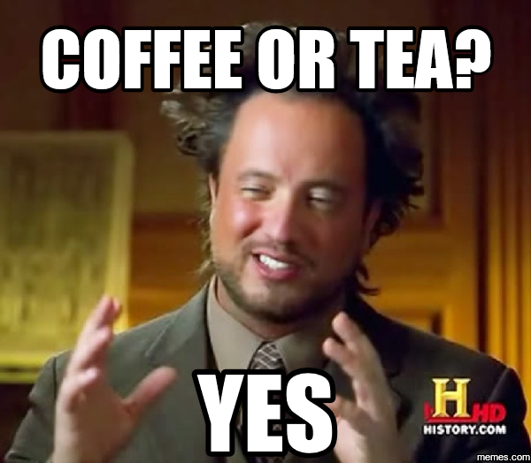
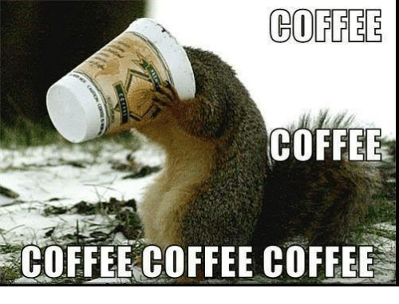
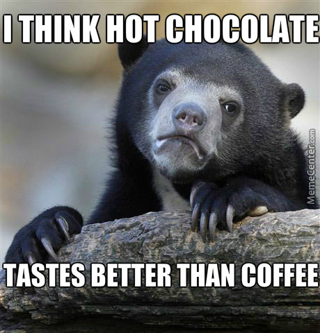

Jelikož je tato stránka určená lidem, kteří s kávou začínají, bylo by vhodné, abychom se i my svěřili se svými začátky. Jak jsme začali pít kávu? Chutnala nám? Na tyto a mnohé další otázky se dozvíte opdovědi po přečtení toho článku.

## Janča

*Prvně začneme s naší šéfovou a zakladatelkou této stránky, aby nám pověděla něco o svých začátcích. Takže, jak si se dostala ke kávě?*

Moje cesta k pití kávy byla poměrně klikatá. S kávou jsem začala flirtovat někdy na nižším stupni gymnázia. Usínala jsem při učení a potřebovala jsem nějakou vzpruhu. Nenapadlo mě nic lepšího, než zkusit si udělat svoje první kafe. Doma jsme tou dobou pochopitelně neměli nic jiného než „turka“ (čti počeštělá turecká káva) nebo tzv. „rozpustku“ (rozpustnou kávu). Udělala jsem si tedy velice silného „turka“ a protože mi přehořká chuť kávy ale vůbec nechutnala, naházela jsem do toho tunu cukru. Po kávě mi bylo neuvěřitelně zle od žaludku. Řekla jsem si tedy, že zkusím rozpustnou kávu. Ta byla podstatněji jemnější a s mlékem a cukrem už se dala vypít, ALE. Káva mě absolutně nevzpružila a zle mi po ní bylo úplně stejně. 
Přešla jsem tedy velice rychle na černé a zelené čaje s tím, že káva mi prostě není souzená. 
Zásadní zlom přišel až v okamžiku, kdy jsem brigádně začala pracovat v kavárně, která pracuje s výběrovou kávou. Ptali se mě, proč kávu nepiji a zda mi mohou zkusit jednu připravit. Přiznám se, že ač trošku skepticky, nakonec jsem kývla. Espresso, které jsem dostala bylo neuvěřitelné. Nebylo hořké, jak jsem znala, ani nijak vodové. Naopak bylo krásně ovocné, šťavnaté a velmi chutné. Uvědomila jsem si, že mi po kávě není špatně, jak jsem byla zvyklá a začala jsem pátrat po tom, proč tomu tak je. Co je to výběrová káva. Jaký je rozdíl mezi arabikou a robustou. Celý proces, kterým káva jde už od rostlinky a třešinky. Jak se káva praží. Jak se správně připravuje. Nastavení mlýnků a kávovaru. Díky mým skvělým šéfům jsem dostala příležitost projít základním baristickým kurzem, a to pod vedením neskutečně šikovné slečny.
Začala jsem pít espressa a snažila se v každém hrnečku najít chuťové profily kávy. 
Další kolegyni jsem zase velice vděčná za trpělivost, se kterou se mě snaží dovzdělat v latte artu.
Co se týče domácí přípravy kávy, začala jsem s přípravou vietnamské kávy. Její příprava totiž nevyžaduje žádné extrémní znalosti ani příslušenství. 
Později jsem přešla na french press. A nyní jsem již několik měsíců hrdou majitelkou „chytráčka“ neboli clever dripperu, který úspěšně zachraňuje každé mé ráno.
Kavárny vybírám s rozvahou. Potrpím si na příjemné prostředí a dobrou kávu, kterou vidím, že baristé ví, jak připravit.

## Marťa

*Dalším členem v pořadí je Marťa. Jaká byla tvoje cesta ke kávě?*

Tak já jsem už jako malá rodičům upijela kávu, kdykoliv ji nechali někde na stole, tak jsem tu trošku, co tam měli dopila. Naši pijí s cukrem a mlékem, tak mi tenkrát chutnala. Líbilo se mi, jak si udělají kafe a je to taková chvíle odpočinku. Jak sem byla straší, tak asi 14, chtěla jsem sama svou tak jsem si dělala kafe, které bylo snad jen z mléka a mnoho cukru. Pak jsem si začala dělat každé ráno a bez cukru mi zachutnalo vic, no a momentálně jsem bez mléka schopna vypít znrkovou dobrou kávu, ale tu rozpustnou pořád s mlékem, a pořád mám ráda cappuccino a latte!

A každý den mám minimálně jednu.

## Kuba

*Posledním členem našho týmu jsem tedy já. Takže vám řeknu samozřejmě i svoji historii s kávou.*

Já se dlouhou dobu kávě vyhíbal jak to jen šlo. Pokaždé jsem si dal raději čaj, pokud možno horkou čokoládu. Nikdy jsem úplně nechápal co na tom všichni vidí a proč je první věc co moji spolužáci ve škole dělali byla, že se šli koupit kávu. Moje první pití kávy bylo, jak už to tak bývá, na rodinné oslavě tetiných narozenin. Dostali zrovna nový kávovar a teta se nás zeptala jestli nechceme zkusit latte. To pro mě káva zase až tak moc nebyla a tak jsem si řekl proč ne. A udělal jsem dobře. Bylo opravdu výborné. Doma jsme kávovar neměli, tak jsem se pokoušel dělat vlastní latte, kdy jsem si vlastně udělal normální rozpustnou kávu akorát jsem ji zalil větším množstvím vyšlehaného mléka. Nebylo to až tak špatné. Ovšem výroba trvala poněkud déle a tak jsem postupně přešel na normální rozpustnou kávu. Dnes si už nedovedu představit večer u televize s hrnkem kávy nebo sobotní snídani s kávou. Ovšem do teď mi nedochází proč ji lidé tak nutně potřebují už zrána, aby byli schopni něco dělat.