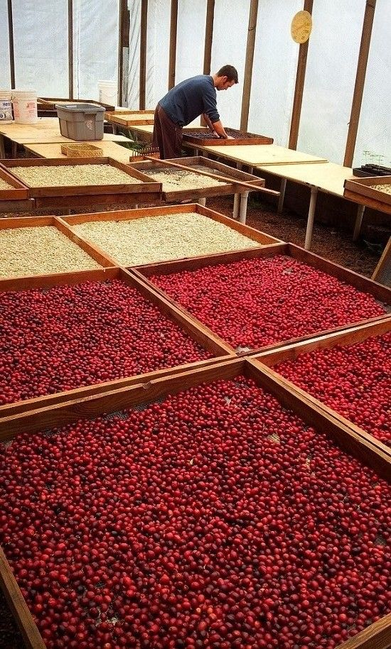
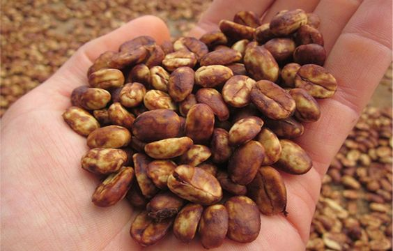
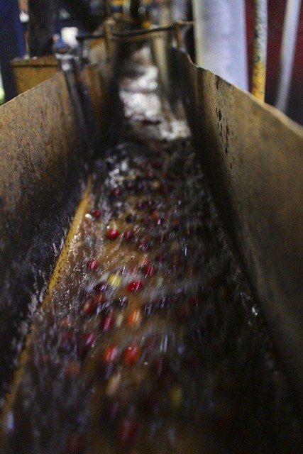

Co že se to vlastně děje po sběru třešní? Káva se dál zpracovává. Základní jsou tři typy zpracování – suché, medové, mokré.

Suché zpracování (natural, dry-processed) 

Kávové třešně farmáři ihned po sběru rozprostřou po zemi (například na betonové podlahy či africké postele), a to rovnoměrně tak, aby ke všem mohl stejně vzduch i sluneční paprsky. Díky působení těchto vlivů třešinky postupně schnou. Plody je třeba pravidelně obracet a prohrabávat, aby všechny kávové třešně uschly rovnoměrně. Na noc se přikrývají, aby zrníčka nezačala hnít.
Průběh sušení trvá až jeden měsíc od utrhnutí plodů z keřů. Po usušení nechají farmáři třešně uležet v silech, aby si odpočinuly a vyrovnala se v nich vlhkost. To trvá zhruba 30-60 dní.
Zrnka kávy, které farmáři zpracují suchým způsobem mají silnější a výraznější tělo. Různé látky ze slupky a dužiny totiž během měsíce postupně pronikají do zrnek. V takových kávách najdeme sladké, medové, oříškové i čokoládové chutě.

Medové zpracování (honey-processed)

Na některých plantážích se nejprve volí varianta vodních lázní, kde probíhá selekce zralých a nezralých plodů. Na jiných plantážích se nepoužívá voda téměř žádná. Třešním rovnou oloupou slupky a zrna suší s pergamenem, a hlavně s dužinou na povrchu. Podle toho, kolik zbylé dužiny má zrno na povrchu se jedná buď o black honey (velké množství dužiny), red honey (střední množství dužiny) a yellow honey (jen malé množství dužiny). Je potřeba, aby byla zrna často prohrabována a otáčena, aby nezačala plesnivět.
Takto zpracovaná káva má jemné, ale výrazné tělo a neobsahuje příliš kyselé tóny, spíše sladší.

Mokré zpracování (fully-washed, wet-processed)

Kávové třešně jsou nejprve promývány vodou ve speciálních nádržích. Zde dochází k oddělení lehkých, seschlých, nedozrálých a nekvalitních plodů, které plavou na povrchu vody, od zralých a těžkých plodů, které leží na dně nádrže. Ihned po promytí ve vodních lázních a selekci se při tomto způsobu zpracování odstraňuje slupka a část dužiny. K oloupání musí dojít 24 hodin od sklizně. Kávové plody jsou loupány pomocí speciálních loupacích strojů. 
Oloupaná zrna putují do kvasných nádrží, kde dochází k fermentaci, která může trvat až 36 hodin. Po tomto způsobu zpracování je třeba zrna usušit, což probíhá zhruba 14cdní. Po zpracování je rozmístí na betonové podlahy nebo africké postele stejně jako u suchého způsobu. Důležité je časté obracení.
Kávy z mokrého způsobu zpracování chutnají velmi svěže, ovocně, květinově a kyseleji než kávy zpracované suchou metodou.

Po zpracování některým z výše uvedených způsobů zrna čeká 1-2 měsíce pauza. Dále se loupou slupky, a to nejčastěji pomocí loupacích strojů. Zrna se dále třídí podle velikosti a kvality.
Po veškerých úpravách a třídění zrnek přichází na řadu ochutnávka různých várek, které putují do pražíren nebo na burzu. 

A o tom dalším až zase někdy příště.

